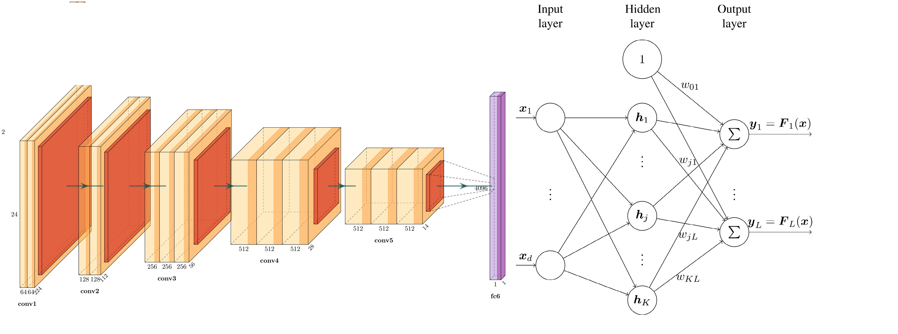
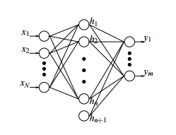

# Combining Radial Basis Function Networks with Convolutional Neural Networks

Prior to the advent of Convolutional Neural Networks (CNNs), Radial Basis Function Neural Networks (RBFs) were much popular in the fields of image recognision and computer vision. But RBFs' lack of adapblity with modern architecture has prevented their integration with the deep learning computer vision research.

Here in this artcile we will trying to combine both of these network architectures to develop something, that gives us the best of both worlds!

## Table of Contents:

1. **[What is a RBF?](#rbf)**
2. **[Why combine it with a CNN?](#why)**
3. **[Problems in combining](#problems)**
4. **[Tackling the Problems](#how)**
5. **[Conclusion](#conclusion)**
6. **[References](#references)**

## What is a RBF?

RBFs are matheatically defined as a global approximation method of a mapping $F$ from a $d$ dimensional feature space to a $K$ dimensional label space $(F:~IR^d\rightarrow IR^K)$[[1]](#references). Or simply put, it is an unsupervised machine learning tool used to categorise multi dimensional data into different classes.

The RBF architecture consists of an input layer, a hidden layer conatining cluster centers $(c_j)$ and an output layer. The cluster centers are seperately learned, generally by using the KNN algorithm.

During the evaluation, or also known as inference, distance is calculated between the input and the cluster centers and an activation function is applied on the obtained distance. Mathematically:

$$
\begin{align}
r^2 = ||x^\mu -c_j||^2_{R_j} = (x-c_j)^TR_j(x-c_j) \\
y_k = F_k(x) = \sum^C_{j=1}w_{jk}h(||x^\mu -c_j||^2_{R_j}) + w_{0k}
\end{align}
$$

Where $r$ represents the distance, $R_j$ is the positive definite covariance matrix (trainable distance), $T$ denotes the matrix transposition, $w_{jk}$ shows the weights of the output layers, $h$ is the activation function, and $w_{0k}$ are the biases. In these equations, $\mu$, $j$, and $k$ enumerate the number of samples, cluster centers, and classes, respectively. The output weights, cluster centers, and covariance matrix are the trainable part of the above equations.

The distance $r$ computed in equation $(1)$ is not only a measure of the proximity of an input point to a cluster center but can also be used to compare different inputs and find similar and dissimilar samples in the input space.

Some of the commonly used activation functions when RBFs are deployed are as follows[[2]](#references):

$$
\begin{align}
h(r)&=r \\
h(r)&=e^{-\frac{r^2}{2\sigma^2}} \\
h(r)&=r^2\ln{r} \\
h(r)&=\frac{1}{1+r^2/\sigma^2}
\end{align}
$$

The training of these networks can be summarised in 3 steps[[3]](#references):

* ***(a) Unsupervised Learning:***

    This step is aimed at finding cluster centers that are representative of the data. The k-means clustering algorithm is widely used for this purpose. k-means iteratively finds a set of cluster centers and minimizes the overall distance between cluster centers and members over the entire dataset. The target of the k-means algorithm can be written in the following form:

    $$
    \begin{align}
    \text{Loss}_{unsupervised} = \sum^K_{j=1}\sum_{x^\mu \in v_j}||x^\mu -c_j||^2
    \end{align}
    $$

    Where $x^\mu \in v_j$ denotes the members of the $j^{th}$ cluster shown by $v_j$.

* ***(b) Computing Weights:***

    The output weights of an RBF network can be computed using a closed-form solution. The matrix of activation of the samples is defined from the training set $(H)$ as follows:

    $$
    \begin{align}
    H = h(||x^\mu -c_j||^2_{R_j})_{\mu=1,...,M,~j=1,...,C}
    \end{align}
    $$

    Based on equation $(2)$, the matrix of output weights $(W)$, which estimates the matrix of labels $(Y)$, is computed by the following equation:

    $$
    \begin{align}
    Y \approx MW \implies W \approx M^\dagger Y
    \end{align}
    $$

    Where $M^\dagger$ is the Moore-Penrose pseudo-inverse matrix of $H$ and is computed as:

    $$
    \begin{align}
    H^\dagger = \lim_{\alpha\rightarrow0^+}(H^TH+\alpha I)^{-1}H^T
    \end{align}
    $$

## References:

[[1]](https://sci2s.ugr.es/keel/pdf/algorithm/articulo/1988-Broomhead-CS.pdf): D. Broomhead and D. Lowe, “Multivariable functional interpolation and adaptive networks, complex systems,” *Tech. Rep*, vol. 2, 1988.

[[2]](https://ieeexplore.ieee.org/document/58326): T. Poggio and F. Girosi, “Networks for approximation and learning,” Proc. *IEEE Inst. Electr. Electron. Eng.*, vol. 78, no. 9, pp. 1481–1497, 1990.

[[3]](https://doi.org/10.1016/S0893-6080(01)00027-2): F. Schwenker, H. A. Kestler, and G. Palm, “Three learning phases for radial-basis-function networks,” *Neural Netw.*, vol. 14, no. 4–5, pp. 439–458, 2001.

