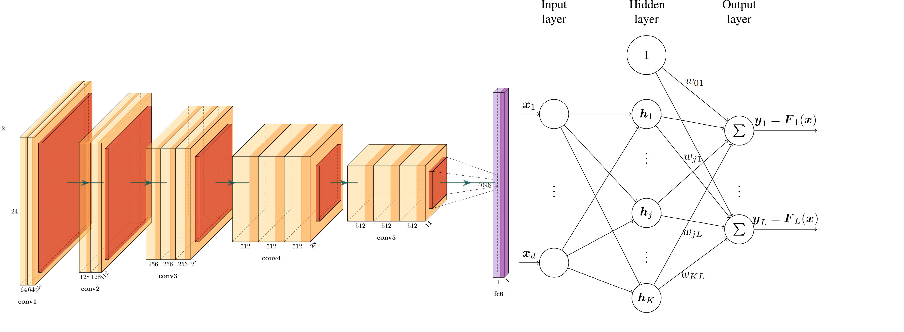

# Combining Radial Basis Function Networks with Convolutional Neural Networks

Prior to the advent of Convolutional Neural Networks (CNNs), Radial Basis Function Neural Networks (RBFs) were much popular in the fields of image recognision and computer vision. But RBFs' lack of adapblity with modern architecture has prevented their integration with the deep learning computer vision research.

Here in this artcile we will trying to combine both of these network architectures to develop something, that gives us the best of both worlds!

## Table of Contents:

1. **[What is a RBF?](#rbf)**
2. **[What is a CNN?](#cnn)**
3. **[Why combine both?](#why)**
4. **[Problems in combining](#problems)**
5. **[Tackling the Problems](#how)**
6. **[Conclusion](#conclusion)**
7. **[References](#references)**

## What is a RBF?

RBFs are matheatically defined as a global approximation method of a mapping $F$ from a $d$ dimensional feature space to a $K$ dimensional label space $(F:~IR^d\rightarrow IR^K)$[[1]](#references). Or simply put, it is an unsupervised machine learning tool used to categorise multi dimensional data into different classes.

The RBF architecture consists of an input layer, a hidden layer conatining cluster centers $(c_j)$ and an output layer. The cluster centers are seperately learned generally by using the KNN algorithm.

## References:

[[1]](https://sci2s.ugr.es/keel/pdf/algorithm/articulo/1988-Broomhead-CS.pdf): D. Broomhead and D. Lowe, “Multivariable functional interpolation and adaptive networks, complex systems,” *Tech. Rep*, vol. 2, 1988.

